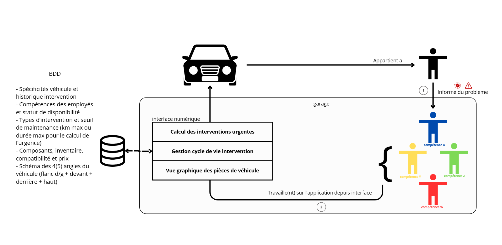

# Retyre

L'objectif de ce projet est de creer un outil permettant a un garage de gerer les interventions sur les vehicules. 
Pour gerer ce projet, nous avons cree un tableau de suivi Trello (https://trello.com/b/EfcOo5Oc/retyre), produit des mockups ainsi que le synoptique suivant:

Mockups

FAITS:
- MODEL (complet)
- TEST partiels
- SCRIPT V1 (V2 a revoir selon les constructeurs qui ont ensuite ete modifies)
- GUI : Intervention, recherche de vehicule, ajout d'un type de vehicule, ajout d'un vehicule et liste des vehicules, etat du garage partiel

A FAIRE:
- GUI: Vue des pieces avec surbrillance des parties au survol, gestion des images, commande des pieces, historique des interventions
- Test du panel d'intervention car probleme de BDD 
